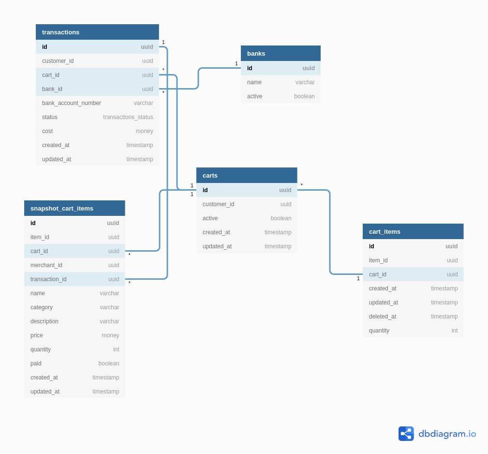

# Table of Content
- [Table of Content](#table-of-content)
- [Badges](#badges)
- [Description](#description)
- [Database Design](#database-design)
- [Features](#features)
- [CI CD](#ci-cd)
- [How to run](#how-to-run)
- [Production](#production)

# Badges
 

# Description
SEA Store is a simple ecommerce project created as a final project for Software Engineering Academy Compfest 2020. SEA Store have 18 user stories covering Users, Items and Transactions. This repository mainly discuss about transactions microservice.

Transaction Microservice is a service that focus on maintan customer transactions, carts, and banks. This service is using Golang and Postgresql as its tech stack and using REST API as a way to communicate between services.

# Database Design

There are 5 tables with its relation and attributes that can be seen in the picture above.

# Features
There are 13 endpoints available in this services. 11 of them are covered in this [swag documentation](https://sea-store-backend-transactions.herokuapp.com/api/docs/index.html).
2 Extra endpoints are
- /api/docs  
  To check api available with its requirements and description.
- /api/metrics  
  To check the metrics of this microservice. Outputs are prometheus datasource.

# CI CD
There 3 stages in CI CD process.
- Test  
  This stage is to make sure that all unit test available for this project are passed successfully before building the project. This process will take the coverage given by the unit test and put it in the repository badges.

- Build  
  This stage is to make sure that all the code are successfully translated into binary.

- Deploy  
  There are 2 jobs in this stage. One for deploying to staging and other for deploying to production. This stage handle making container for the project and push it to heroku container to be serve

# How to run
- Make sure docker and docker compose are availables in your machine. If not check these documentation from docker. [docker-engine](https://docs.docker.com/engine/install/) [docker-compose](https://docs.docker.com/compose/install/)
- Make sure go are installed in your machine. Check this documentation if you dont have go. [golang](https://golang.org/doc/install)
- Copy the .env.example file and rename it to .env
- Edit the credentials in .env based on your needs or use the default ones.
- If you used the default environment please run ``docker-compose up -d postgre``. If not you can proceed to next step
- run ``go mod tidy``
- run ``go run main.go``

# Production
Production Links: https://sea-store-backend-transactions.herokuapp.com/